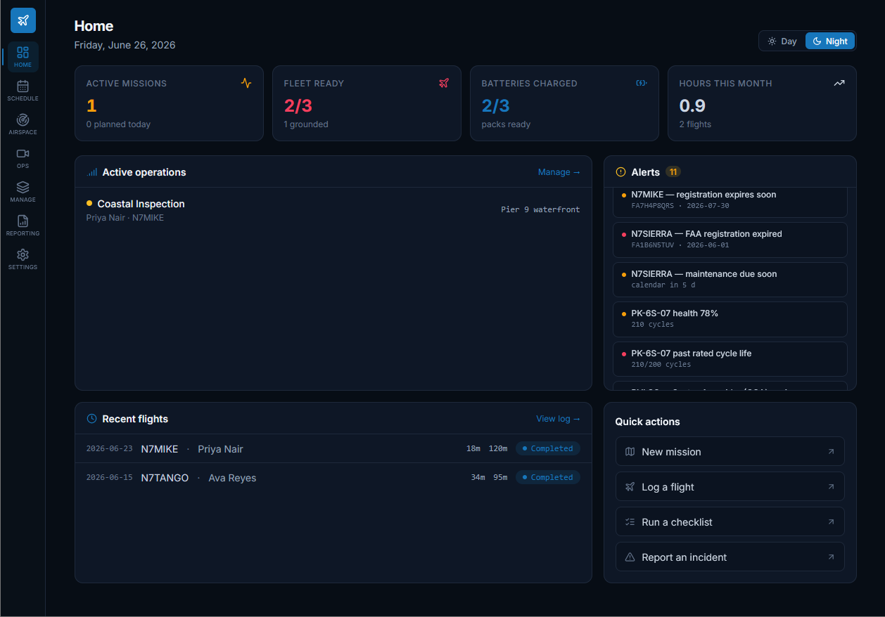

# FlightDeck — UAS Ops Console

A **local-first** drone / UAS (Unmanned Aircraft System) operations console that runs entirely in your
browser. Plan missions, log flights, track your fleet and batteries, manage Part 107 compliance, schedule
crews, and watch live airspace & telemetry — with **all data stored on your own device**.

> **Privacy by design:** FlightDeck has no backend and no account. Your records live in your browser
> (`localStorage`) and, optionally, in a local folder you choose. Nothing is uploaded to a server unless
> you explicitly connect one.



**Live demo:** [ihr0s22.github.io/FlightOps-UAS](https://ihr0s22.github.io/FlightOps-UAS/)

## Features

- **Missions & scheduling** — plan operations, assign crew/aircraft, calendar view with crew double-booking detection.
- **Flight logging** — sorties roll up into fleet hours, cycles, and battery health automatically.
- **Fleet & batteries** — registration, Remote ID, maintenance intervals, cycle-life tracking.
- **Compliance** — Part 107 waivers / COAs and a document vault, with expiry alerts.
- **Checklists, risk assessments, maintenance & incident logs.**
- **Airspace** — live ADS-B traffic, sectional/aerial basemaps, and weather (Open-Meteo / METAR).
- **OPS center** — live video (HLS/MJPEG/WebRTC) and normalized telemetry (Simulator / WebSocket / MQTT).
- **Reporting** — build reports across entities, export CSV/PDF, schedule recurring exports.
- **Resilient by default** — first-run chooser (empty vs. demo data), save-status indicator,
  safe deletes (no orphaned references), and graceful error/empty states with retry.

## Quick start

Requires [Node.js](https://nodejs.org/) 18+ (20 recommended).

```bash
git clone https://github.com/ihr0s22/FlightOps-UAS.git
cd FlightOps-UAS
npm install
npm run dev        # http://localhost:5173
```

Build a production bundle:

```bash
npm run build      # outputs to dist/
npm run preview    # preview the built bundle locally
```

On first launch you'll be asked to **start with an empty workspace** or **load demo data**. You can switch
later from **Settings → Reset workspace**.

## Data & storage

- **Browser storage (default):** all records are saved to `localStorage` automatically as you work.
- **Local folder (optional, Chrome/Edge):** Settings → Storage → *Connect drive folder* writes a
  `flightdeck.json` to a folder you pick (e.g. on an external drive) and reloads it on launch. This uses the
  [File System Access API](https://developer.mozilla.org/docs/Web/API/File_System_Access_API) and requires
  HTTPS (GitHub Pages qualifies).
- **Export / Import:** Settings → Storage → *Export file* / *Import file* for manual backups and transfer
  between machines or browsers.

## Optional network services

FlightDeck works fully offline for its core features. A few features make **outbound** requests only when
you actively use them — no telemetry or analytics are ever sent:

| Feature | Calls | When |
| --- | --- | --- |
| Airspace traffic | `opendata.adsb.fi` (or your local ADS-B receiver) | clicking *ADS-B* |
| Weather | `api.open-meteo.com` / `aviationweather.gov` | clicking *Fetch* |
| OPS video/telemetry | your stream / WebSocket / MQTT URLs; `hls.js` & `mqtt.js` from cdnjs | when connected |
| Relay sync | a backend URL you configure | when you set one |

## Deploying (GitHub Pages)

This repo includes a workflow at `.github/workflows/deploy.yml` that builds and publishes on every push to
`main`:

1. Push this repository to GitHub.
2. In **Settings → Pages**, set **Source = GitHub Actions**.
3. Push to `main` — the site deploys to `https://ihr0s22.github.io/FlightOps-UAS/`.

Asset paths are relative (`base: "./"` in `vite.config.js`), so it works on any subpath, custom domain, or
other static host (Netlify, Vercel, Cloudflare Pages) — just run `npm run build` and serve `dist/`.

## Browser support

Modern evergreen browsers. The optional *connect drive folder* feature needs Chromium-based browsers
(Chrome/Edge); everything else (including Export/Import) works everywhere.

## Tech stack

[React 18](https://react.dev/) · [Vite](https://vitejs.dev/) · [Tailwind CSS](https://tailwindcss.com/) ·
[Recharts](https://recharts.org/) · [lucide-react](https://lucide.dev/). No backend, no database.

## License

[Apache-2.0](./LICENSE) © 2026 Ian Rosario.

> FlightDeck is an operations aid, not a system of record for regulatory filing. Always verify against
> official sources (FAA registration, LAANC, current charts/NOTAMs) before flight.
